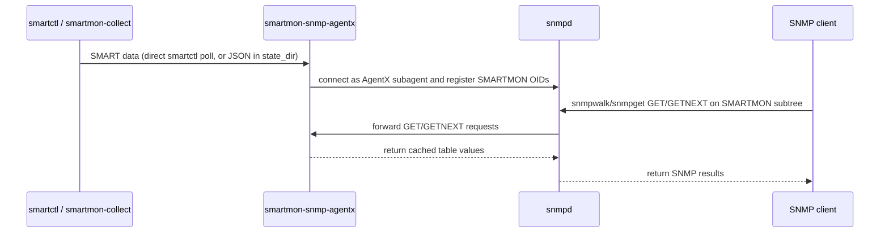

# smartmon-snmp-agentx

A self-contained Python SNMP AgentX subagent (RFC 2741) that exposes SMART
drive health data via the SMARTMON-* MIBs.

Supports **NVMe**, **SATA/ATA**, and partial **SAS/SCSI** drive data.

---

## Overview

`smartmon-snmp-agentx` is a single Python script (`smartmon_agentx.py`) that
connects to a running `snmpd` master agent over a Unix domain socket, registers
the SMARTMON-* OID subtrees, and responds to SNMP GET/GETNEXT/GETBULK requests.
It also sends SNMP v2 traps when drive health changes or self-tests fail.

It requires the **`python3-netsnmpagent`** module.  SQLite persistence uses the
Python standard library — no extra package needed.

The agent obtains SMART data in one of two ways:

1. **collect mode** (`collect: true` / `--collect`) — the agent polls
   `smartctl` directly.  No `state_dir` or external collector is required.  It
   runs `smartctl` as root when the agent is root, otherwise via
   `sudo -n smartctl`.
2. **file mode** (default) — the agent reads JSON state files from a configured
   `state_dir`, written either by the included `smartmon-collect` timer or by
   `smartd --jsonstate`.

```text
collect mode:   smartmon-snmp-agentx ──(smartctl)──┐
                                                    ├──> snmpd ──> SNMP manager
file mode:      smartmon-collect ──> *.json ──> smartmon-snmp-agentx ──┘
```

## Sequence Diagram(s)




---

## MIB structure

Enterprise OID: `1.3.6.1.4.1.65891.1.1` (placeholder; TODO: replace with an assigned IANA PEN before publication)

| Sub-tree | MIB | Status | Contents |
|----------|-----|--------|----------|
| `.1` | SMARTMON-TC-MIB | Implemented | Textual conventions |
| `.2` | SMARTMON-COMMON-MIB | Implemented | Device inventory table, device count scalar |
| `.3` | SMARTMON-NVME-MIB | Implemented | NVMe health, self-test, controller, namespace, error log |
| `.4` | SMARTMON-SATA-MIB | Implemented | SATA attributes, self-test, info, health, error log |
| `.5` | SMARTMON-SAS-MIB | Partial | SAS health, error counters, self-test, background scan |
| `.6` | SMARTMON-SENSOR-MIB | Implemented | Unified physical sensor table and threshold notifications |

MIB files are installed to `/usr/share/snmp/mibs/`.

SAS/SCSI support is not complete because the project is missing enough
representative `smartctl -x -j` SAS output references to validate and fill every
MIB field reliably.

---

## Prerequisites

- **`python3`** (3.8+)
- **`python3-netsnmpagent`** — the net-snmp Python AgentX bindings
- **`python3-yaml`** — for the YAML config file (a plain `key value` file also works)
- **`snmp`** and **`snmpd`** for live SNMP integration tests
- **`smartmontools`** for `smartctl` (and `smartd` if using file mode)
- In collect mode as a non-root user: **`sudo`** with a passwordless `smartctl` grant
- In file mode: read access to the configured `state_dir`

On Debian/Ubuntu:

```bash
sudo apt-get install python3 python3-netsnmpagent python3-yaml snmp snmpd smartmontools
```

---

## Installation

### Using the install script

```bash
sudo scripts/install-agentxd.sh
```

The install script installs the agent (`smartmon_agentx.py` → `/usr/sbin/smartmon-snmp-agentx`),
its Python dependencies, the YAML config, MIB files, the systemd unit, and by
default the `smartmon-collect` timer that writes JSON state files.

### Manual install

```bash
sudo install -d /usr/sbin /etc/smartmontools /usr/share/snmp/mibs /lib/systemd/system
id -u smartmon >/dev/null 2>&1 || \
    sudo useradd --system --no-create-home --shell /usr/sbin/nologin smartmon
getent group Debian-snmp >/dev/null && sudo usermod -aG Debian-snmp smartmon
getent group snmp >/dev/null && sudo usermod -aG snmp smartmon
sudo install -d -m 750 -o root -g smartmon /run/smartmontools/json
sudo install -d -m 750 -o smartmon -g smartmon /var/lib/smartmontools/snmp-agent
# The script carries a #!/usr/bin/env python3 shebang and runs directly
sudo install -m 755 smartmon_agentx.py /usr/sbin/smartmon-snmp-agentx
sudo install -m 755 bin/smartmon-collect /usr/sbin/
sudo install -m 640 etc/smartmon-snmp-agentx.yaml \
    /etc/smartmontools/snmp-agentx.yaml
sudo install -m 644 doc/SMARTMON-*.mib /usr/share/snmp/mibs/
sudo sed -e 's|@sbindir@|/usr/sbin|' \
          -e 's|@sysconfdir@|/etc|' \
    systemd/smartmon-snmp-agentx.service.in \
    | sudo tee /lib/systemd/system/smartmon-snmp-agentx.service >/dev/null
sudo install -m 644 systemd/smartmon-collect.service \
    systemd/smartmon-collect.timer /lib/systemd/system/
sudo systemctl daemon-reload
```

### Remote install

To deploy to another host over SSH (copies the script, config, units, and MIBs,
installs Python deps, and configures snmpd remotely):

```bash
scripts/install-remote.sh ops@server01
```

---

## Configuration

### Data source

**Collect mode** — let the agent poll `smartctl` itself; set in the config:

```yaml
collect: true
```

When the agent runs as a non-root user, grant it passwordless `smartctl`:

```bash
echo 'smartmon ALL=(root) NOPASSWD: /usr/sbin/smartctl' \
    | sudo tee /etc/sudoers.d/smartmon-agentx
```

**File mode** (default) — use `smartmon-collect.timer` to discover drives, run
`smartctl -x -j`, and write JSON files to `/run/smartmontools/json/`:

```bash
systemctl enable --now smartmon-collect.timer
ls /run/smartmontools/json/   # JSON files should appear here after the timer runs
```

### snmpd

Add AgentX master support to `/etc/snmp/snmpd.conf`:

```conf
master agentx
agentXSocket /var/agentx/master
# Group is distro-dependent: Debian-snmp on Debian/Ubuntu, snmp on RHEL/Fedora.
agentXPerms 0660 0550 root Debian-snmp
rocommunity public 127.0.0.1 .1.3.6.1.4.1.65891
```

Restart snmpd:
```bash
systemctl restart snmpd
```

### smartmon-snmp-agentx

Edit `/etc/smartmontools/snmp-agentx.yaml` (YAML):

```yaml
# Poll smartctl directly instead of reading state_dir files
collect: false

# Directory where smartmon-collect or smartd writes JSON state files
# (required in file mode; ignored in collect mode)
state_dir: /run/smartmontools/json/

# AgentX master socket — must match agentXSocket in snmpd.conf
agentx_socket: /var/agentx/master

# Data refresh / poll interval in seconds (default: 300)
cache_timeout: 300

# SQLite state DB persisting table LastChange timestamps and notification
# baselines across restarts.  The agent creates the file if it does not exist.
state_db: /var/lib/smartmontools/snmp-agent/snmp-agentx-state.db
```

The database directory must be writable by the daemon user. The installed
systemd unit allows writes to `/var/lib/smartmontools/snmp-agent` for this
purpose.
If `state_db` is unset, table `LastChange` scalars remain accurate within a
run but reset to first-parse time after restart.

Table `LastChange` timestamps are content based: the agent hashes each table
after parsing and updates the corresponding timestamp only when that table's
SNMP-visible contents change. This prevents ordinary polling from making SNMP
managers see false table changes.

---

## Starting the service

If using the `smartmon-collect` timer (file mode):

```bash
systemctl enable --now smartmon-collect.timer
systemctl enable --now smartmon-snmp-agentx
systemctl status smartmon-snmp-agentx
```

In collect mode, the timer is not needed:

```bash
systemctl enable --now smartmon-snmp-agentx
```

---

## Verifying

```bash
# List all monitored devices
snmpwalk -v2c -c public localhost 1.3.6.1.4.1.65891.1.1.2

# NVMe health
snmpwalk -v2c -c public localhost 1.3.6.1.4.1.65891.1.1.3

# SATA attributes
snmpwalk -v2c -c public localhost 1.3.6.1.4.1.65891.1.1.4

# SAS health and error counters
snmpwalk -v2c -c public localhost 1.3.6.1.4.1.65891.1.1.5

# Unified sensor table
snmpwalk -v2c -c public localhost 1.3.6.1.4.1.65891.1.1.6

# Human-readable output (requires MIBs in /usr/share/snmp/mibs/):
snmpwalk -v2c -c public -m ALL localhost \
    SMARTMON-COMMON-MIB::smartmonDeviceTable
```

---

## Command-line options

| Option | Description |
|--------|-------------|
| `-c, --config FILE` | Path to YAML config file (default: `/etc/smartmontools/snmp-agentx.yaml`) |
| `-f` | Run in foreground (do not daemonise; useful for debugging) |
| `--collect` | Poll `smartctl` directly instead of reading `state_dir` |
| `--state-dir DIR` | Directory containing smartd `--jsonstate` JSON files (file mode) |
| `--cache-timeout SEC` | Data refresh / poll interval in seconds (config key: `cache_timeout`) |
| `--state-db PATH` | SQLite persistence file (overrides config `state_db`) |
| `--agentx-socket PATH` | AgentX master socket path |
| `--log-level LEVEL` | `DEBUG-AGENTX`, `DEBUG`, `VERBOSE`, `INFO`, `NOTICE`, `WARNING`, `ERROR`. `DEBUG-AGENTX` is `DEBUG` plus raw net-snmp AgentX PDU tracing to the log file/stderr. |
| `--log-file PATH` | Append log output to this file in addition to stderr |
| `--once` | Collect and publish once, then exit |
| `-h, --help` | Print usage and exit |

---

## Running and testing

### Run directly

```bash
# File mode against a directory of JSON state files, in the foreground
./smartmon_agentx.py -f --state-dir /run/smartmontools/json --log-level INFO

# Collect mode (polls smartctl; use sudo or run as root for device access)
sudo ./smartmon_agentx.py -f --collect --log-level INFO

# One-shot smoke test
./smartmon_agentx.py --once --state-dir /run/smartmontools/json
```

### Integration test (live SNMP)

Requires `snmpd` and `python3-netsnmpagent`:

```bash
# Run the Python agent against fixture JSON files
AGENTXD_BIN=smartmon_agentx.py ci/run_integration_test.py
```

The integration test:
1. Starts `snmpd` on `127.0.0.1:10161` with a temp AgentX socket (no root needed)
2. Starts the agent against fixture JSON files
3. Runs `snmpwalk` over all MIB subtrees
4. Validates MIB values and trap notifications across all device types

### Docker (full integration test)

```bash
ci/run_docker_py.sh
```

This builds a container (`ci/Dockerfile.agentx_py`) with `python3-netsnmpagent`
and runs the full integration test suite against the Python agent.

---

## Resource usage

The agent is lightweight. Typical footprint for ~12,000 published OIDs
(≈11 drives), as seen in `htop`:

| Metric | Value | Meaning |
|--------|-------|---------|
| **RES** (resident) | ~50 MB | Actual physical RAM. Roughly ~29 MB Python interpreter, ~14 MB shared libraries, ~5–8 MB OID data. This is the number that matters. |
| **SHR** (shared) | ~14 MB | Shared library code (`libpython`, `libnetsnmp`, `libc`, …), shared system-wide. |
| **VIRT** (virtual) | ~210 MB | Reserved address space, *not* consumed — dominated by the three thread stacks and glibc malloc arenas. Safe to ignore. |

OID data scales linearly at ~300 bytes per OID. Per-drive raw `smartctl` JSON is
freed after each build (not retained). During a refresh the worker briefly holds
a second copy of the OID map (~2× transient) while handing it to the main thread.

Setting `MALLOC_ARENA_MAX=2` in the service environment shrinks VIRT cosmetically
but does not meaningfully change RES.

---

## Notifications (SNMP traps)

The agent sends v2 traps to the snmpd master for:

| Trap | OID | Trigger |
|------|-----|---------|
| `smartmonDeviceDiscovered` | `.2.3.1` | Device row added |
| `smartmonDeviceRemoved` | `.2.3.2` | Device row removed |
| `smartmonDevicePollFailed` | `.2.3.3` | Poll result is non-ok |
| `smartmonNvmeHealthFailed` | `.3.2.1` | NVMe health indicates failure |
| `smartmonNvmeSelfTestFailed` | `.3.2.2` | NVMe self-test result is non-zero |
| `smartmonSataHealthFailed` | `.4.2.1` | SATA overall health reports failure |
| `smartmonSataAttrFailing` | `.4.2.2` | SATA attribute is failing or below threshold |
| `smartmonSataSelfTestFailed` | `.4.2.3` | SATA self-test result is failed |
| `smartmonSasHealthFailed` | `.5.2.1` | SAS overall health reports failure |
| `smartmonSasSelfTestFailed` | `.5.2.2` | SAS self-test result is failed |
| `smartmonSasUncorrectedErrorsIncreased` | `.5.2.3` | SAS uncorrected error counter increases |
| `smartmonSensorHighCriticalExceeded` | `.6.2.1` | Sensor reading reaches high critical threshold |
| `smartmonSensorHighWarningExceeded` | `.6.2.2` | Sensor reading reaches high warning threshold |
| `smartmonSensorLowWarningExceeded` | `.6.2.3` | Sensor reading reaches low warning threshold |
| `smartmonSensorLowCriticalExceeded` | `.6.2.4` | Sensor reading reaches low critical threshold |

`SMARTMON-SENSOR-MIB` also defines `smartmonSensorNonOperational` at `.6.2.5`;
the current agent emits the threshold notifications listed above.

---

## Troubleshooting

**Agent exits immediately:**
Check the journal for config errors:
```bash
journalctl -u smartmon-snmp-agentx -n 50
```
Common causes: `python3-netsnmpagent` not installed, `state_dir` not set (file
mode), no JSON files in `state_dir`, or `agentx_socket` path does not exist
(snmpd not running or AgentX disabled).
If using `smartmon-collect`, check `systemctl status smartmon-collect.timer`
and `journalctl -u smartmon-collect.service -n 50`.

**collect mode logs a sudoers hint and serves no devices:**
The agent could not run `smartctl` as a non-root user. Grant passwordless
access:
```bash
echo 'smartmon ALL=(root) NOPASSWD: /usr/sbin/smartctl' \
    | sudo tee /etc/sudoers.d/smartmon-agentx
```

**snmpwalk returns "No Such Object":**
The agent may not have registered yet.  Check:
```bash
snmpget -v2c -c public localhost 1.3.6.1.4.1.65891.1.1.2.1.1.0
```
Should return `Gauge32: N` (number of devices).

**Empty NVMe self-test or SAS error counter tables:**
`smartmon-collect` and collect mode use `smartctl -x -j` by default. If using
`smartd`, ensure it is configured with `-x` (extended monitoring), not just `-a`.

**snmpwalk shows numeric OIDs instead of names:**
Install MIBs to `/usr/share/snmp/mibs/` and use `-m ALL`:
```bash
export MIBS=ALL
snmpwalk -v2c -c public localhost 1.3.6.1.4.1.65891.1.1
```
