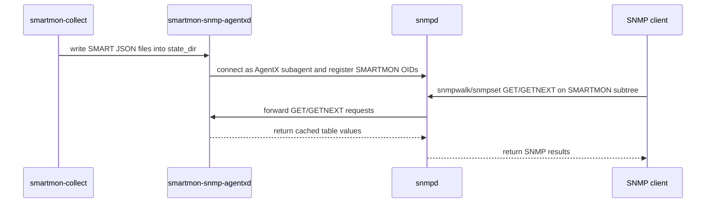

# smartmon-snmp-agentxd

An SNMP AgentX subagent (RFC 2741) that exposes SMART drive health data
from smartmontools JSON state files via the SMARTMON-* MIBs.

Supports **NVMe**, **SATA/ATA**, and partial **SAS/SCSI** drive data.

---

## Overview

`smartmon-snmp-agentxd` connects to a running `snmpd` master agent over a
Unix domain socket, registers the SMARTMON-* OID subtrees, and responds to
SNMP GET/GETNEXT/GETBULK requests.  It also sends SNMP v2 traps when drive
health changes or self-tests fail.

The agent reads JSON state files from a configured `state_dir`. Those files are
written by the included `smartmon-collect` timer. The agent process itself never
invokes `smartctl` directly.

```text
smartmon-collect timer
      └── writes *.json  ──>  smartmon-snmp-agentxd  ──>  snmpd  ──>  SNMP manager
```

## Sequence Diagram(s)




---

## MIB structure

Enterprise OID: `1.3.6.1.4.1.9999.1.1` (placeholder; TODO: replace with an assigned IANA PEN before publication)

| Sub-tree | MIB | Status | Contents |
|----------|-----|--------|----------|
| `.1` | SMARTMON-TC-MIB | Implemented | Textual conventions |
| `.2` | SMARTMON-COMMON-MIB | Implemented | Device inventory table, device count scalar |
| `.3` | SMARTMON-NVME-MIB | Implemented | NVMe health, self-test, controller, namespace, error log |
| `.4` | SMARTMON-SATA-MIB | Implemented | SATA attributes, self-test, info, health, error log |
| `.5` | SMARTMON-SAS-MIB | Partial | SAS health, error counters, self-test, background scan |
| `.6` | SMARTMON-SENSOR-MIB | Implemented | Unified physical sensor table and threshold notifications |

MIB files are installed to `/usr/share/snmp/mibs/`.

SAS/SCSI support is not complete because the project is missing enough
representative `smartctl -x -j` SAS output references to validate and fill every
MIB field reliably.

---

## Prerequisites

- **`g++`** with C++14 support
- **`make`**
- **`libsnmp-dev`** for net-snmp headers, libraries, and `net-snmp-config`
- **`snmp`** and **`snmpd`** for live SNMP integration tests
- **`smartmontools`** for `smartctl`, `smartd`, or both
- Read access to the configured `state_dir`

On Debian/Ubuntu:

```bash
sudo apt-get install g++ make libsnmp-dev snmp snmpd smartmontools
```

---

## Installation

### From a source build

```bash
make -j$(nproc)
sudo scripts/install-agentxd.sh
```

The install script installs the daemon, config file, MIB files, systemd unit,
and by default the `smartmon-collect` timer that writes JSON state files.

### Manual install

```bash
sudo install -d /usr/sbin /etc/smartmontools /usr/share/snmp/mibs /lib/systemd/system
id -u smartmon >/dev/null 2>&1 || \
    sudo useradd --system --no-create-home --shell /usr/sbin/nologin smartmon
getent group Debian-snmp >/dev/null && sudo usermod -aG Debian-snmp smartmon
getent group snmp >/dev/null && sudo usermod -aG snmp smartmon
sudo install -d -m 750 -o root -g smartmon /run/smartmontools/json
sudo install -m 755 .build/smartmon-snmp-agentxd /usr/sbin/
sudo install -m 755 bin/smartmon-collect /usr/sbin/
sudo install -m 644 etc/smartmon-snmp-agentxd.conf \
    /etc/smartmontools/snmp-agentxd.conf
sudo install -m 644 doc/SMARTMON-*.mib /usr/share/snmp/mibs/
sudo sed -e 's|@sbindir@|/usr/sbin|' \
          -e 's|@sysconfdir@|/etc|' \
    systemd/smartmon-snmp-agentxd.service.in \
    | sudo tee /lib/systemd/system/smartmon-snmp-agentxd.service >/dev/null
sudo install -m 644 systemd/smartmon-collect.service \
    systemd/smartmon-collect.timer /lib/systemd/system/
sudo systemctl daemon-reload
```

---

## Configuration

### JSON collection

The recommended local install uses `smartmon-collect.timer` to discover drives,
run `smartctl -x -j`, and write JSON files to `/run/smartmontools/json/`:

```bash
systemctl enable --now smartmon-collect.timer
ls /run/smartmontools/json/   # JSON files should appear here after the timer runs
```

### snmpd

Add AgentX master support to `/etc/snmp/snmpd.conf`:

```conf
master agentx
agentXSocket /var/agentx/master
# Group is distro-dependent: Debian-snmp on Debian/Ubuntu, snmp on RHEL/Fedora.
agentXPerms 0660 0550 root Debian-snmp
rocommunity public 127.0.0.1 .1.3.6.1.4.1.9999
```

Restart snmpd:
```bash
systemctl restart snmpd
```

### smartmon-snmp-agentxd

Edit `/etc/smartmontools/snmp-agentxd.conf`:

```conf
# Directory where smartmon-collect or smartd writes JSON state files (required)
state_dir       /run/smartmontools/json/

# AgentX master socket — must match agentXSocket in snmpd.conf
agentx_socket   /var/agentx/master

# Cache timeout in seconds (default: 300)
cache_timeout   300
```

---

## Starting the service

If using the recommended `smartmon-collect` timer:

```bash
systemctl enable --now smartmon-collect.timer
systemctl enable --now smartmon-snmp-agentxd
systemctl status smartmon-snmp-agentxd
```

---

## Verifying

```bash
# List all monitored devices
snmpwalk -v2c -c public localhost 1.3.6.1.4.1.9999.1.1.2

# NVMe health
snmpwalk -v2c -c public localhost 1.3.6.1.4.1.9999.1.1.3

# SATA attributes
snmpwalk -v2c -c public localhost 1.3.6.1.4.1.9999.1.1.4

# SAS health and error counters
snmpwalk -v2c -c public localhost 1.3.6.1.4.1.9999.1.1.5

# Unified sensor table
snmpwalk -v2c -c public localhost 1.3.6.1.4.1.9999.1.1.6

# Human-readable output (requires MIBs in /usr/share/snmp/mibs/):
snmpwalk -v2c -c public -m ALL localhost \
    SMARTMON-COMMON-MIB::smartmonDeviceTable
```

---

## Command-line options

| Option | Description |
|--------|-------------|
| `-c FILE` | Path to config file (default: `/etc/smartmontools/snmp-agentxd.conf`) |
| `-f` | Run in foreground (do not daemonise; useful for debugging) |
| `-v` | Verbose logging: scan flow and device load summaries |
| `-vv` | Very verbose logging: per-sensor detail and SNMP iterator calls |
| `-h` | Print usage and exit |

---

## Building and testing

### Build

```bash
make -j$(nproc)
```

### Static build

Full static linking depends on static versions of net-snmp and its dependency
libraries being installed on the build host:

```bash
make clean
make LDFLAGS="-static"
```

Check the result with:

```bash
ldd .build/smartmon-snmp-agentxd
```

A fully static binary usually reports `not a dynamic executable`. If full static
linking fails because static net-snmp dependencies are unavailable, use a
partially static C++ runtime build instead:

```bash
make clean
make LDFLAGS="-static-libstdc++ -static-libgcc"
```

### Unit tests

```bash
cd tests
make test
```

### Integration test (live SNMP)

Requires `snmpd` and the built binary:

```bash
# Auto-detects binary in .build/
ci/run_integration_test.py

# Or specify explicitly:
AGENTXD_BIN=.build/smartmon-snmp-agentxd \
    ci/run_integration_test.py
```

The integration test:
1. Starts `snmpd` on `127.0.0.1:10161` with a temp AgentX socket (no root needed)
2. Starts `smartmon-snmp-agentxd` against fixture JSON files
3. Runs `snmpwalk` over all MIB subtrees
4. Validates MIB values and trap notifications across all device types

### Docker (full build + integration test)

```bash
ci/run_docker.sh
```

This builds using `ghcr.io/smartmontools/docker-build:master` as the base and
runs the full integration test suite inside a container.

### Debian 11 export build

Use the Debian 11 export build when you need a release binary linked against
Debian 11 system net-snmp libraries instead of libraries from your local build
environment:

```bash
ci/build_debian11_export.sh
```

Artifacts are written to `.tmp/export/debian11/`:

| File | Description |
|------|-------------|
| `smartmon-snmp-agentxd` | Exported daemon binary |
| `ldd.txt` | Dynamic library linkage report |
| `file.txt` | Binary type report |
| `packages.txt` | Debian package versions used for the build |
| `build-info.txt` | Compiler and net-snmp build flags |

The export build fails if `ldd.txt` contains `/usr/local`, which prevents
accidental linkage against a developer-installed net-snmp build.

---

## Notifications (SNMP traps)

The agent sends v2 traps to the snmpd master for:

| Trap | OID | Trigger |
|------|-----|---------|
| `smartmonDeviceDiscovered` | `.2.3.1` | Device row added |
| `smartmonDeviceRemoved` | `.2.3.2` | Device row removed |
| `smartmonDevicePollFailed` | `.2.3.3` | Poll result is non-ok |
| `smartmonNvmeHealthFailed` | `.3.2.1` | NVMe health indicates failure |
| `smartmonNvmeSelfTestFailed` | `.3.2.2` | NVMe self-test result is non-zero |
| `smartmonSataHealthFailed` | `.4.2.1` | SATA overall health reports failure |
| `smartmonSataAttrFailing` | `.4.2.2` | SATA attribute is failing or below threshold |
| `smartmonSataSelfTestFailed` | `.4.2.3` | SATA self-test result is failed |
| `smartmonSasHealthFailed` | `.5.2.1` | SAS overall health reports failure |
| `smartmonSasSelfTestFailed` | `.5.2.2` | SAS self-test result is failed |
| `smartmonSasUncorrectedErrorsIncreased` | `.5.2.3` | SAS uncorrected error counter increases |
| `smartmonSensorHighCriticalExceeded` | `.6.2.1` | Sensor reading reaches high critical threshold |
| `smartmonSensorHighWarningExceeded` | `.6.2.2` | Sensor reading reaches high warning threshold |
| `smartmonSensorLowWarningExceeded` | `.6.2.3` | Sensor reading reaches low warning threshold |
| `smartmonSensorLowCriticalExceeded` | `.6.2.4` | Sensor reading reaches low critical threshold |

`SMARTMON-SENSOR-MIB` also defines `smartmonSensorNonOperational` at `.6.2.5`;
the current agent emits the threshold notifications listed above.

---

## Troubleshooting

**Agent exits immediately:**
Check syslog for config errors:
```bash
journalctl -u smartmon-snmp-agentxd -n 50
```
Common causes: `state_dir` not set, no JSON files in `state_dir`, or
`agentx_socket` path does not exist (snmpd not running or AgentX disabled).
If using `smartmon-collect`, check `systemctl status smartmon-collect.timer`
and `journalctl -u smartmon-collect.service -n 50`.

**snmpwalk returns "No Such Object":**
The agent may not have registered yet.  Check:
```bash
snmpget -v2c -c public localhost 1.3.6.1.4.1.9999.1.1.2.1.1.0
```
Should return `Gauge32: N` (number of devices).

**Empty NVMe self-test or SAS error counter tables:**
`smartmon-collect` uses `smartctl -x -j` by default. If using `smartd`, ensure
it is configured with `-x` (extended monitoring), not just `-a`.

**snmpwalk shows numeric OIDs instead of names:**
Install MIBs to `/usr/share/snmp/mibs/` and use `-m ALL`:
```bash
export MIBS=ALL
snmpwalk -v2c -c public localhost 1.3.6.1.4.1.9999.1.1
```
